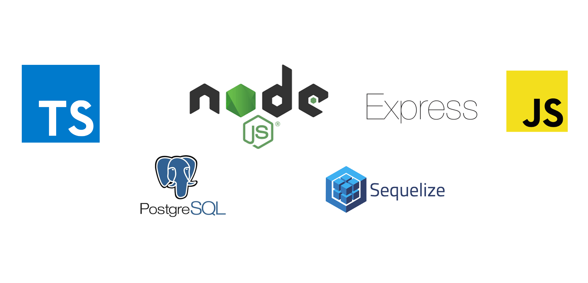

[](http://docs.sequelizejs.com)

# Description

This is a project created from good practices such as clean code, SOLID, etc.

## Installation

Create an .env file and add the variables present in the .env.example file. Afterwards, run the following command:

```zsh
  docker-compose up -d
```

## Usage

Run the command below to launch the application:

```zsh
  yarn db:seed
```

Your web server is now exposed on http://localhost:3000.

Run the command below to feed the database:

```zsh
  yarn db:seed
```

Run the following command to run all tests

```zsh
  yarn test
```
